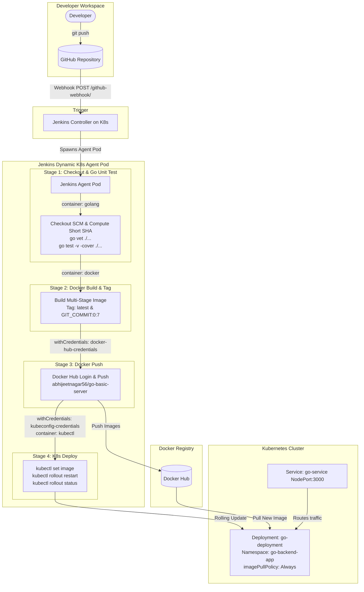

# Go Backend Application - Kubernetes CI/CD Pipeline with Jenkins & Terraform

A production-grade CI/CD pipeline for a containerized Go HTTP backend application running on Kubernetes, provisioned via Terraform, and orchestrated through a declarative 4-stage Jenkins Pipeline with Docker Hub and GitHub Webhook integration.

---

## 📌 Architecture & Workflow



---

## 📁 Repository Structure

```text
├── app/
│   ├── dockerfile        # Multi-stage optimized Dockerfile (Go build + Alpine runtime)
│   ├── go.mod            # Go module definition
│   ├── main.go           # Go HTTP web server (port 3000: /, /api/status, /api/greet)
│   └── main_test.go      # Go unit tests covering all HTTP handlers
├── kube/
│   └── jenkins-agent-rbac.yaml  # ClusterRole and ClusterRoleBinding for Jenkins agent
├── terraform/
│   ├── main.tf           # K8s Namespace, Deployment (image_pull_policy = "Always"), Service
│   ├── variables.tf      # Configurable variables (replicas, image, namespace, ports)
│   └── outputs.tf        # Terraform outputs (namespace, deployment name, service port)
├── cmd.md                # Reference commands for Helm Jenkins installation
├── Jenkinsfile           # Declarative 4-stage Jenkins Pipeline
└── README.md             # Complete setup and integration documentation
```

---

## 🛠️ Prerequisites

Ensure you have the following tools and accounts ready:

- **Kubernetes Cluster**: Minikube, Kind, K3s, EKS, GKE, or AKS.
- **kubectl**: CLI configured to communicate with your cluster.
- **Helm 3.x**: Package manager for deploying Jenkins.
- **Terraform (>= 1.0.0)**: Infrastructure as Code tool.
- **Docker Hub Account**: Account at [Docker Hub](https://hub.docker.com/) (e.g. `abhijeetnagar56`).
- **GitHub Repository**: Housing this repository.

---

## 🚀 Step 1: Provision Kubernetes Infrastructure with Terraform

The infrastructure is defined declaratively using the Terraform Kubernetes Provider in `terraform/main.tf`.

1. Navigate to the `terraform/` directory:
   ```bash
   cd terraform
   ```

2. Initialize Terraform and install the Kubernetes provider:
   ```bash
   terraform init
   ```

3. Review the execution plan:
   ```bash
   terraform plan
   ```

4. Apply the configuration to create the `go-backend-app` namespace, deployment, and NodePort service:
   ```bash
   terraform apply -auto-approve
   ```

> [!NOTE]
> `terraform/main.tf` configures `image_pull_policy = "Always"` on `go-container`. This ensures Kubernetes always pulls the fresh image from Docker Hub whenever a rollout restart occurs.

---

## 🏗️ Step 2: Install Jenkins on Kubernetes via Helm

1. Add and update the Jenkins Helm repository:
   ```bash
   helm repo add jenkins https://charts.jenkins.io
   helm repo update
   ```

2. Create the `jenkins` namespace:
   ```bash
   kubectl create namespace jenkins
   ```

3. Install Jenkins with NodePort service enabled:
   ```bash
   helm install jenkins jenkins/jenkins \
     --namespace jenkins \
     --set controller.serviceType=NodePort \
     --set controller.nodePort=32000
   ```

4. Retrieve the initial admin password:
   ```bash
   kubectl exec --namespace jenkins -it svc/jenkins -c jenkins -- /bin/cat /run/secrets/additional/chart-admin-password && echo
   ```

5. Access Jenkins in your browser:
   - If using Minikube: `minikube service jenkins -n jenkins` or `http://<minikube-ip>:32000`
   - If using local/cloud cluster: `http://<node-ip>:32000`

6. Apply RBAC permissions for the Jenkins Kubernetes agent:
   ```bash
   kubectl apply -f kube/jenkins-agent-rbac.yaml
   ```

---

## 🔑 Step 3: Configure Jenkins Credentials

The pipeline requires two credentials stored securely in Jenkins:

### 1. `docker-hub-credentials` (Docker Registry Access)
1. Go to **Jenkins Dashboard** > **Manage Jenkins** > **Credentials** > **System** > **Global credentials (unrestricted)**.
2. Click **Add Credentials**.
3. Fill in the fields:
   - **Kind**: `Username with password`
   - **Scope**: `Global (Jenkins, nodes, items, all child items, etc.)`
   - **Username**: Your Docker Hub username (e.g. `abhijeetnagar56`)
   - **Password**: Your Docker Hub Personal Access Token (or password)
   - **ID**: `docker-hub-credentials` *(Must match exactly)*
   - **Description**: `Docker Hub registry credentials for image push`
4. Click **Create**.

### 2. `kubeconfig-credentials` (Kubernetes Cluster Access)
1. In the same credentials view, click **Add Credentials**.
2. Fill in the fields:
   - **Kind**: `Secret file`
   - **Scope**: `Global (Jenkins, nodes, items, all child items, etc.)`
   - **File**: Upload your cluster's `kubeconfig` file (typically located at `~/.kube/config`)
   - **ID**: `kubeconfig-credentials` *(Must match exactly)*
   - **Description**: `Kubeconfig file for deploying to Kubernetes cluster`
3. Click **Create**.

---

## ⚙️ Step 4: Create the Jenkins Pipeline Job

1. From the Jenkins Dashboard, click **New Item**.
2. Enter an item name (e.g., `go-backend-cicd`) and select **Pipeline**. Click **OK**.
3. Under the **Build Triggers** section:
   - Check **GitHub hook trigger for GITScm polling**.
4. Under the **Pipeline** section:
   - **Definition**: Select `Pipeline script from SCM`
   - **SCM**: Select `Git`
   - **Repository URL**: `https://github.com/AbhijeetNagar56/devops-ci-cd-learn.git`
   - **Credentials**: Select your GitHub credentials if private (or leave empty if public)
   - **Branch Specifier**: `*/main` (or your target branch)
   - **Script Path**: `Jenkinsfile`
5. Click **Save**.

---

## 🔗 Step 5: Configure GitHub Webhook for Automated CI/CD

To trigger the pipeline automatically on every `git push`:

1. Open your GitHub repository in your browser.
2. Navigate to **Settings** > **Webhooks** > **Add webhook**.
3. Configure the webhook settings:
   - **Payload URL**: `http://<JENKINS_HOST>:32000/github-webhook/`
     *(Make sure the trailing slash `/` is included. If running locally, expose Jenkins using [ngrok](https://ngrok.com/): `ngrok http 32000` and use `https://<ngrok-id>.ngrok-free.app/github-webhook/`)*
   - **Content type**: `application/json`
   - **Secret**: *(Leave empty unless configured in Jenkins)*
   - **Which events would you like to trigger this webhook?**: Select **Just the push event**.
   - **Active**: Ensure the checkbox is checked.
4. Click **Add webhook**.
5. GitHub will send a test `ping` event. A green checkmark indicates successful connection.

---

## 🔄 Step 6: Pipeline Stages Breakdown

The declarative [`Jenkinsfile`](file:///home/gokuu/Documents/work/DevOps/ciCdPipeline/jenkins/Jenkinsfile) executes 4 distinct stages inside dedicated Kubernetes Pod containers:

| # | Stage Name | Container | Description |
|---|------------|-----------|-------------|
| 1 | **Checkout & Go Unit Test** | `golang:1.23-alpine` | Checks out source code, computes the 7-character commit short SHA (`${GIT_COMMIT:0:7}`), runs `go vet ./...` and `go test -v -cover ./...`. |
| 2 | **Docker Build & Tag** | `docker:27-cli` | Builds the multi-stage Docker container from `app/dockerfile` and tags it with both `${GIT_COMMIT:0:7}` and `latest`. |
| 3 | **Docker Push** | `docker:27-cli` | Logs into Docker Hub using `docker-hub-credentials` and pushes both tags to `abhijeetnagar56/go-basic-server`. |
| 4 | **K8s Deploy** | `bitnami/kubectl:latest` | Authenticates with `kubeconfig-credentials`, updates the container image via `kubectl set image`, restarts pods via `kubectl rollout restart deployment/go-deployment -n go-backend-app`, and waits for rollout confirmation. |

---

## 🧪 Step 7: Verification & Testing

### 1. Test Application Endpoints
To verify the deployed Go backend application:

```bash
# Port-forward the service to localhost:3000
kubectl port-forward svc/go-service -n go-backend-app 3000:3000
```

In another terminal, test the endpoints:
```bash
# Root endpoint
curl http://localhost:3000/
# Output: Go Backend: you are at endpoint: /

# Health/Status endpoint (used by K8s liveness and readiness probes)
curl http://localhost:3000/api/status
# Output: Status: online

# Greet endpoint
curl http://localhost:3000/api/greet
# Output: hello World
```

### 2. Check Kubernetes Deployment and Pods
```bash
kubectl get deployments,pods,services -n go-backend-app -o wide
```

### 3. Check Pod Logs
```bash
kubectl logs -n go-backend-app -l app=go-backend-app --tail=50
```
